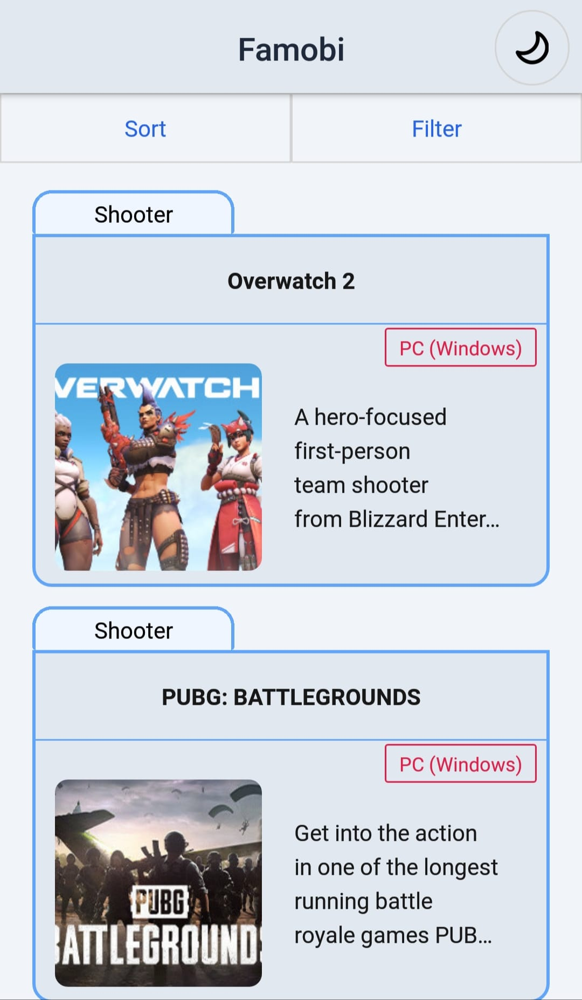
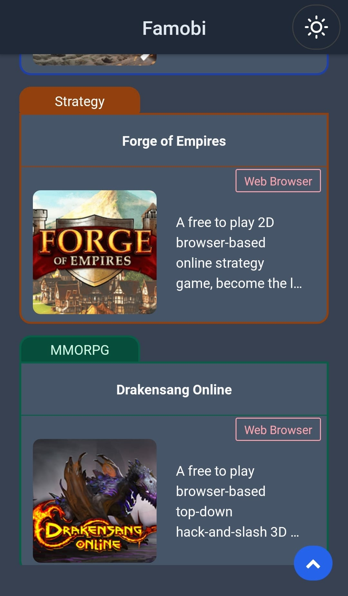
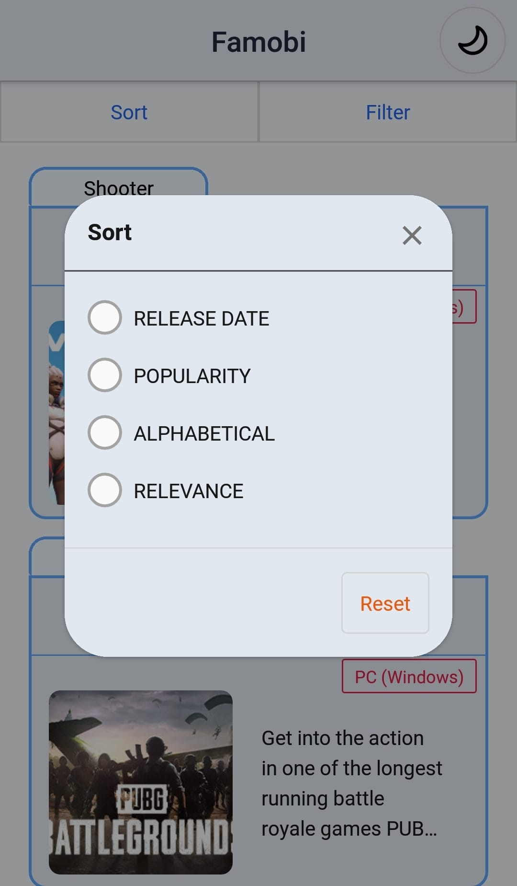
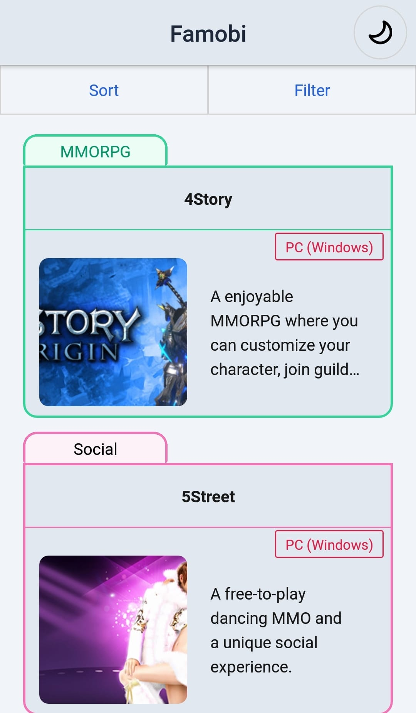
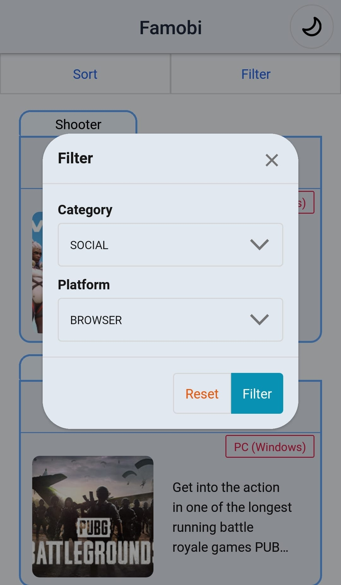
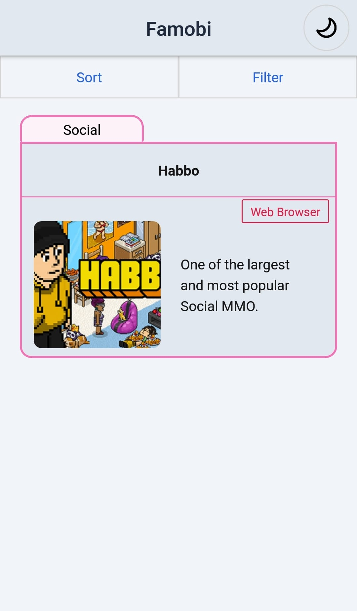

# List Free Games

This project is listing the free games from [FREETOGAME Api](https://www.freetogame.com/api-doc). All data is fetched from the API. The listed items can be sorted, and it is also possible to apply filters based on categories and platforms as provided by the API. In this project, [NativeBase](https://nativebase.io/) used as design system.

## Installation

1. Clone the repository: `git clone https://github.com/Onurhnf/list-free-games-frontend-mobile-reactnative-nativebase`
2. Install the dependencies: `npm install`
3. Start the app: `npm start`

- You can scan the QR code with Expo Go (Android) or the Camera app (iOS)
- If using an emulator, press "a" for Android or "i" for iOS to start the React Native Expo app.

## Screenshots

## Extra Problem Solution

After cloning the repository, you can check how the problem solved. To see the result, you can run `node ExtraProblem.js`. This will execute the code and display the output.

## Contact

To connect with me or discuss any questions or issues related to the project, you can reach out to me via email at **onurhnf@gmail.com**
